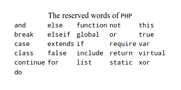
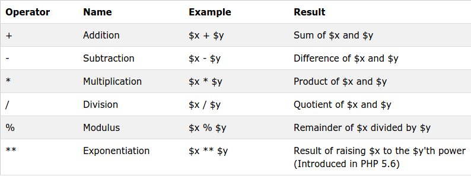
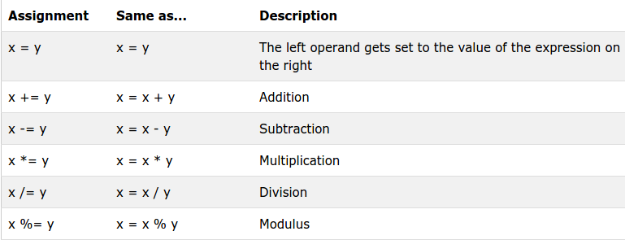
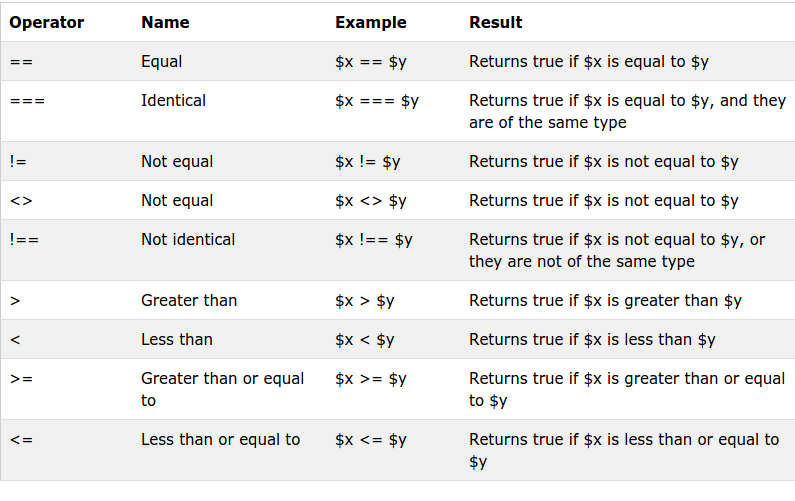
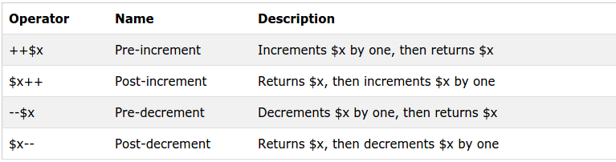
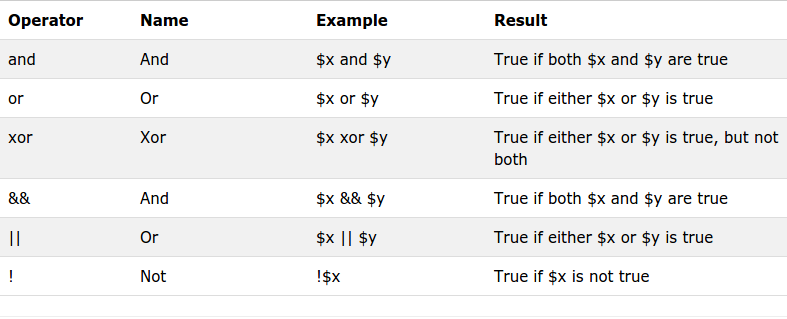
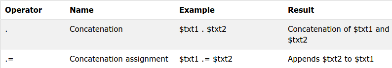
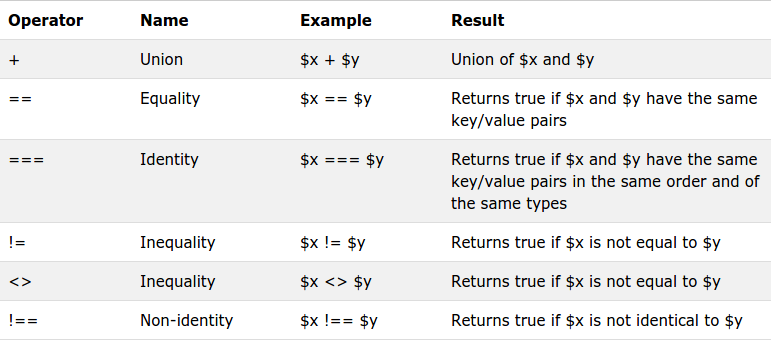

# Introduction to programming in PHP
- Overview of PHP
- General syntactic characteristics
- Primitives, operations and expressions Output
- Control statements
- Arrays
- Functions
- Pattern matching
- Form handling
- Files
- Cookies
- Session tracking.

## Overview of PHP
PHP (recursive acronym for PHP: Hypertext Preprocessor)  is a server side scripting language which was build by Rasmus Lerdorf on the year 1994

### What is a PHP developer do?
PHP developers develop programs, applications, and web sites using the dynamic scripting language PHP. PHP is known for web development and business applications. Depending on job function, PHP developers may be classified as software developers or web developers.

## General Syntax
- Saved with file extension .php (sample.php, example.php)
- Code block starts with <?php  ....
- Code block ends with ?>
- Files can be referenced using the following Syntax

    <?php
      include("example.php");
    ?>

- All variables in PHP begins with dollar sign ($)
- Followed by a letter or underscore, followed by any number of letters, digits, or underscores
- Variable names are case sensitive
- Neither reserved names nor functions are case sensitive

- PHP Comments are of two types Single and Multiple Line
- Single line: //
- Multiple line: /* ...
- PHP statements terminated with a (;)

## Primitives, Operations and Expressions Output
PHP supports eight primitive types

### Boolean eg: (0 - 1, Y - N)

    <?php
     $x = true;
     $y = false;
    ?>

### Integer eg: (0 - 9)

    <?php
     $x = 1000;
     var_dump($x);
    ?>

### Float eg: (0.0 - 0.9)

    <?php
     $x = 10.365;
     var_dump($x);
    ?>

### String eg: ("Hello world")

    <?php
     $x = "Hello";
     $y = "World";
     echo $x;
     echo ' ';
     echo $y;
    ?>

### Array eg: array(1, 2, 3, 4)

    <?php
     $cars = array("Volvo","BMW","Toyota");
     var_dump($cars);
    ?>

### Object

    <?php
      class Car {
          function Car() {
            $this->model = "VW";
          }
      }
    
        // create an object
        $herbie = new Car();
    
        // show object properties
        echo $herbie->model;
    ?>

### NULL

    <?php
        $x = "Hello world!";
        $x = null;
        var_dump($x);
    ?>

### Resource

      The special resource type is not an actual data type. It is the storing of a reference to functions and resources external to PHP.
      A common example of using the resource data type is a database call.

## Operators

- Arithmetic operators
- Assignment operators
- Comparison operators
- Increment/Decrement operators
- Logical operators
- String operators
- Array operators

### Arithmetic Operators

### Assignment Operators

### Comparison Operators

### Increment/Decrement operators

### Logical Operators

### String Operators

### Array Operators

